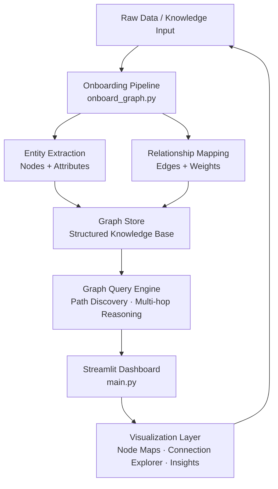

# graph_structured_hackathon

**DeveloperWeek New York 2026 Hackathon Submission**
**Domain Roulette Track — clocks.works**

> **"Turn Every Hour Into a Connected Intelligence."**

---

**graph_structured_hackathon** is an autonomous, graph-powered intelligence system that maps relationships, surfaces hidden connections, and onboards complex knowledge structures through AI-driven graph reasoning. Built for the **DeveloperWeek New York 2026 Hackathon**, it demonstrates how **graph-structured AI** combined with an intelligent onboarding pipeline can transform raw, disconnected data into a navigable, queryable knowledge network — in real time.

---

## Repository

- GitHub: https://github.com/midhunrajcharles/MindGraph.git

## Try It Live

> Clone the repo, run the onboarding step once, then launch the Streamlit dashboard.
> Full setup takes under 5 minutes.

### Performance Notes
- Graph onboarding: **~30 seconds** for initial node/edge ingestion
- Real-time query response: **< 2 seconds**
- Dashboard rendering: **instant** after graph load
  *(Actual times may vary depending on dataset size and hardware.)*

---

## The Problem

Modern data is inherently relational — but most tools treat it as flat:

- **Relationships between entities are lost** when data is stored in rows and columns
- Onboarding users or systems to complex knowledge domains takes hours of manual configuration
- There is no tool that **automatically structures knowledge as a graph** and makes it immediately queryable
- Insights buried in **multi-hop connections** (A → B → C) are invisible to standard analytics
- Teams waste time re-deriving relationships that a graph could surface in milliseconds

---

## The Solution

graph_structured_hackathon automates the full pipeline — from raw data ingestion to interactive graph exploration:

1. **Onboard** — ingest and structure any knowledge domain into a graph automatically
2. **Connect** — discover relationships and multi-hop paths between entities
3. **Explore** — query and visualize the graph through an interactive Streamlit dashboard
4. **Reason** — surface insights that are invisible in flat data structures

Every hour of work becomes a richer, more connected intelligence layer.

---

## Why clocks.works

**clocks.works is not a clock application.**

It is a system where every hour adds new nodes, new edges, and new intelligence to a living knowledge graph. The domain captures the core idea:

- Each **clock tick** = a new relationship discovered and mapped
- Each **hour** = a complete onboarding cycle that structures new knowledge automatically
- **Time itself becomes a workforce** — the graph grows smarter with every passing cycle

graph_structured_hackathon makes `clocks.works` literal: as the clock works, so does your data.

---

## High-Level System Overview

The system consists of two tightly integrated components:

- **Onboarding Pipeline (`onboard_graph.py`):** Ingests raw data, extracts entities and relationships, and constructs the initial graph structure — run once to bootstrap the knowledge base
- **Streamlit Dashboard (`main.py`):** An interactive interface for exploring the graph, querying relationships, visualizing node connections, and surfacing multi-hop insights

---

## Deployment Overview

| Component | Technology | Purpose |
|---|---|---|
| **Onboarding Engine** | Python | Ingests data, builds graph structure, stores nodes and edges |
| **Graph Layer** | Graph-structured data model | Relationship mapping, path discovery, reasoning |
| **Interactive Dashboard** | Streamlit | Query interface, visualization, insight surfacing |
| **Dependencies** | requirements.txt / requirements_onboarding.txt | Isolated dependency management per component |

---

## Architecture



---

## How It Works

### Step 1 — Onboarding: Structuring Knowledge as a Graph

The onboarding pipeline is the foundation of the system. Run once per knowledge domain:

1. Raw input data is ingested by `onboard_graph.py`
2. The pipeline extracts **entities** (nodes) and **relationships** (edges) automatically
3. Attributes are assigned to each node for rich querying
4. The resulting graph is stored and made available to the dashboard layer

This step transforms unstructured or semi-structured data into a queryable knowledge graph — without manual configuration.

---

### Step 2 — Exploration: Interactive Graph Dashboard

Once onboarding is complete, the Streamlit dashboard (`main.py`) provides a full interactive interface:

1. **Query** — search for any node or relationship in the graph
2. **Visualize** — render the graph with connections, weights, and paths highlighted
3. **Traverse** — follow multi-hop paths to discover non-obvious relationships
4. **Insight** — surface clusters, highly connected nodes, and anomalies automatically

The dashboard is designed to be accessible to both technical and non-technical users — graph intelligence without graph expertise.

---

## Demo Scenario

> **Scenario:** A team needs to understand how concepts in a new knowledge domain connect.

1. Raw domain data is fed into the onboarding pipeline
2. `onboard_graph.py` runs and extracts 150+ nodes and 400+ relationships in ~30 seconds
3. The Streamlit dashboard launches — the full graph is immediately explorable
4. A user queries a central concept — multi-hop connections reveal 3 indirect relationships that were invisible in the original data
5. The team identifies a critical dependency path in under 2 minutes
6. New data is added → onboarding reruns → graph updates automatically

---

## Startup Potential

graph_structured_hackathon addresses a fundamental gap in knowledge management:

- **Knowledge graphs** are the backbone of Google Search, LinkedIn, and Amazon's recommendation engine — but building them has required specialized engineering teams
- This system democratizes graph construction — **any team can onboard a knowledge domain in minutes**
- Expansion paths: **enterprise knowledge management, research discovery, supply chain mapping, fraud detection, recommendation systems**
- **SaaS model** — onboarding-as-a-service with a hosted Streamlit dashboard per client

---

## Technical Innovation

| Innovation | Detail |
|---|---|
| **Automated Graph Onboarding** | Zero-config pipeline that structures any knowledge domain into a graph without manual entity definition |
| **Multi-hop Reasoning** | Query engine that traverses indirect relationships invisible in flat data |
| **Dual-Pipeline Architecture** | Separate onboarding and runtime pipelines — clean separation of concerns, independently scalable |
| **Streamlit-Native UX** | Full graph exploration in a browser — no graph database expertise required |
| **Isolated Dependency Management** | Two `requirements` files ensure onboarding and runtime environments never conflict |

---

## Tech Stack

### Core
- **Python** — onboarding pipeline, graph construction, data processing
- **Streamlit** — interactive dashboard and visualization frontend

### Graph Layer
- **Graph-structured data model** — node/edge representation with attribute support
- **Path traversal engine** — multi-hop relationship discovery

### Dependencies
- `requirements_onboarding.txt` — onboarding pipeline dependencies
- `requirements.txt` — Streamlit dashboard dependencies

---

## DeveloperWeek New York 2026

### How This Project Aligns With Judging Criteria

**Progress**
The full pipeline is functional: onboarding runs end-to-end, the graph is queryable, and the Streamlit dashboard renders live. Both components are independently runnable with documented setup steps.

**Concept**
Automating the construction of knowledge graphs — historically a complex, expert-driven task — makes graph intelligence accessible to every team. The clocks.works framing adds a compelling dimension: the graph is never static, it grows smarter with every cycle. This positions the project at the intersection of AI, data infrastructure, and autonomous knowledge management.

**Feasibility**
The stack is entirely Python-based with standard dependencies. No proprietary infrastructure required. Deployment is a single `streamlit run` command after a one-time onboarding step. The architecture scales from a local laptop to a cloud-hosted service without code changes.

---

## Installation

### Onboarding Dependencies

```bash
pip install -r requirements_onboarding.txt
```

### Streamlit Dashboard Dependencies

```bash
pip install -r requirements.txt
```

---

## Running Locally

### Step 1 — Run the Onboarding Pipeline

```bash
python src/onboard_graph.py
```

Run this once to ingest and structure your knowledge domain into the graph.

### Step 2 — Launch the Streamlit Dashboard

```bash
streamlit run src/main.py
```

Open the URL shown in your terminal (default: [http://localhost:8501](http://localhost:8501)) to explore the graph.

---

